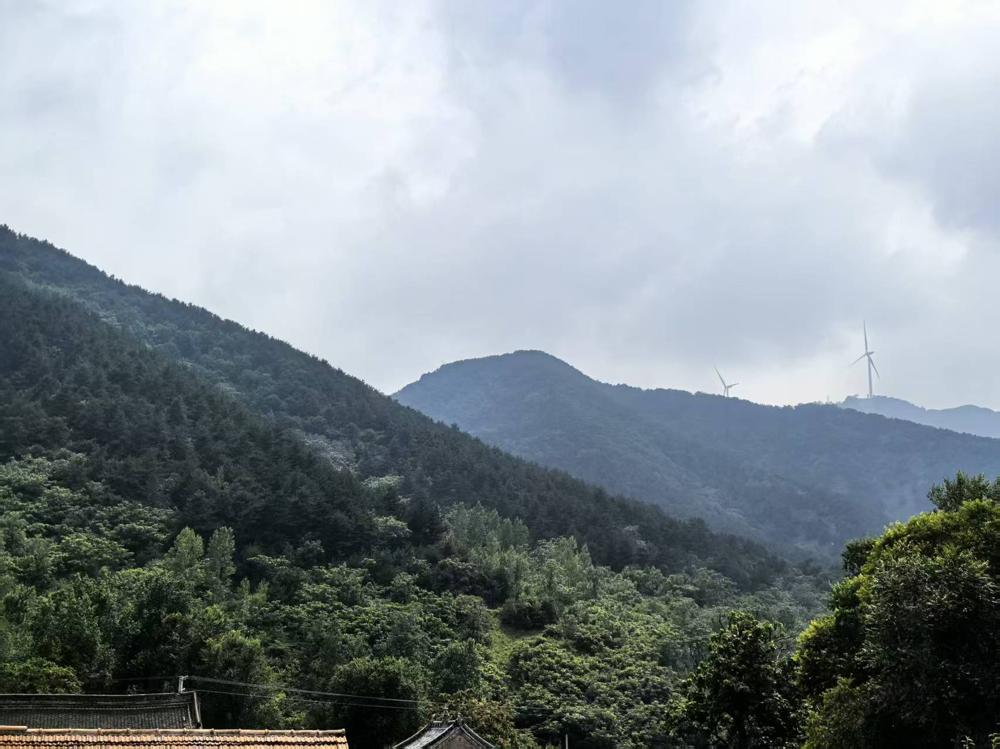
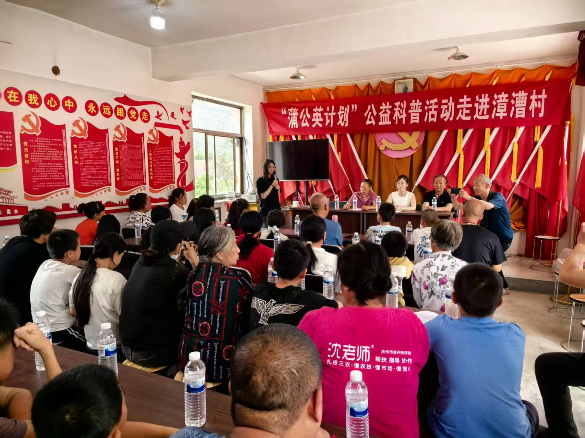

# The Dandelion Project

The Dandelion Project is a bilingual English / Chinese public health education website for the Dandelion Initiative. It presents the project's field-based vaccine education work, research background, decision-making framework, timeline, field observations, volunteer recruitment, team structure, and donation information.

The site is designed to communicate evidence-based vaccine education and preventive health work in rural communities with a calm, editorial, nonprofit visual language.


## Overview

The website introduces the Dandelion Initiative as a public health education project focused on vaccine awareness, preventive care, and rural community outreach.

It includes:

- Project introduction and origin story
- Research background and field observations
- The interactive Dandelion Decision Framework
- Project snapshot metrics
- Timeline / roadmap
- Field Notes from Zhangcao Village
- Volunteer recruitment
- Leadership and team page
- Dedicated donation page with partner foundation information

The goal is to make preventive health communication feel understandable, trustworthy, and actionable.

## Features

- Responsive React website for desktop, tablet, and mobile
- English / Chinese language switch
- Sticky header and smooth anchor scrolling
- Editorial-style storytelling sections
- Full-width hero imagery and project snapshot metrics
- Interactive Decision Framework with hover highlighting
- Project timeline with alternating vertical layout
- Field Notes section with observation blocks and image collage
- Dedicated Leadership & Team page
- Compact team cards with expandable bios and bilingual initials
- Volunteer recruitment section with role descriptions and email CTA
- Dedicated Donate page with Renze Foundation CTA, WeChat QR code, partner details, and budget transparency
- Modern CSS transitions and hover states using Tailwind classes
- Frontend-only implementation with no backend or payment processing

## Design Philosophy

The visual direction is intentionally nonprofit, research-oriented, and editorial rather than commercial or dashboard-like.

Key principles:

- Editorial storytelling over marketing-heavy layout
- Calm nonprofit tone
- Warm neutral background colors
- Deep green and warm gold accents
- Accessible typography with English and Chinese font fallbacks
- Minimal UI chrome and restrained card usage
- Research-based presentation of public health decision-making

## Tech Stack

This project uses:

- [React 18](https://react.dev/) for UI components
- [Vite 5](https://vitejs.dev/) for development and production builds
- [Tailwind CSS 3](https://tailwindcss.com/) for styling
- [React Router DOM 6](https://reactrouter.com/) for `/`, `/team`, and `/donate` routes
- JavaScript / JSX
- PostCSS and Autoprefixer through the Tailwind build pipeline
- Static assets from `public/images`
- Vercel for deployment

The project does not currently use TypeScript, Framer Motion, Lucide React, or a backend service.

## Project Structure

```text
.
├── public/
│   └── images/                 # Hero, field, QR, and project images
├── src/
│   ├── components/
│   │   ├── layout/             # Header, footer, language toggle
│   │   ├── sections/           # Homepage and page sections
│   │   └── ui/                 # Reusable UI components
│   ├── data/
│   │   └── siteContent.js      # Central bilingual content source
│   ├── pages/
│   │   ├── DonatePage.jsx
│   │   └── TeamPage.jsx
│   ├── styles/
│   │   └── globals.css         # Tailwind imports and shared component classes
│   ├── App.jsx                 # Routes and page composition
│   └── main.jsx                # React entry point
├── index.html
├── package.json
├── postcss.config.js
├── tailwind.config.js
└── vite.config.js
```

## Main Sections

### Home

The homepage begins with a full-width image hero, bilingual headline, credibility metadata, and calls to explore the framework and timeline.

### Project Snapshot

A metric band under the hero summarizes active years, media views, funds raised, village targets, volunteer doctor targets, and research design.

### About

The About area introduces the project origin, founder context, academic research reference, core insight, and high-level “What We Do” pillars.

### Decision Framework

The Dandelion Decision Framework explains how Trust, Perception, and Access influence decision readiness and chosen prevention. The diagram is editable React/Tailwind UI and includes subtle hover highlighting.

### Field Notes

The Field Notes section restores field observations from Zhangcao Village, including a documentary-style image collage and observation blocks.

### Timeline

The Timeline section shows the project roadmap from the 2025 Zhangcao Village pilot through 2026 research and 2027 scale-up planning.

### Volunteer

The Volunteer section invites participation in doctor training, community education, research support, and field coordination. The CTA links to a volunteer email workflow.

### Team

The `/team` page includes a Founder Leadership section and a bilingual team grid. Team bios are expandable to keep cards compact.

### Donate

The `/donate` page includes a short hero, Renze Foundation donation CTA, WeChat QR code, institutional partner details, and 2027 budget transparency information.

## Bilingual Content

All main website copy is centralized in [`src/data/siteContent.js`](src/data/siteContent.js).

The content uses bilingual objects:

```js
{
  en: 'English text',
  zh: '中文内容'
}
```

The helper function `t(value, lang)` returns the correct language value and falls back safely when needed. The active language is stored in React state inside [`src/App.jsx`](src/App.jsx), passed into page and section components, and applied to `document.documentElement.lang`.

To update copy, edit `siteContent.js` instead of changing layout components.

## Design System

### Typography

The site uses serif-led editorial typography with Chinese font fallbacks:

- Display / heading: `Playfair Display`, `Noto Serif SC`, `Songti SC`, Georgia, serif
- Serif body: `Source Serif 4`, `Noto Serif SC`, `Songti SC`, Georgia, serif
- Sans fallback: Inter, `Noto Sans SC`, `PingFang SC`, Arial, sans-serif
- Mono labels: `DM Mono`, Inter, CJK sans fallbacks

### Color Palette

Defined in [`tailwind.config.js`](tailwind.config.js):

- Cream background: `#F7F5F2`
- Warm cream: `#EFE8DC`
- Ink: `#1A1714`
- Muted ink: `#4A443D`, `#7B7064`
- Brand green / sage: `#2F5D3A`
- Warm gold: `#C8A96A`
- Pale gold: `#F5EDD8`
- Border: `#D8D0C4`
- Paper: `#FFFFFF`

### Layout and Spacing

Shared section spacing is handled by the `.section-shell` component class in [`src/styles/globals.css`](src/styles/globals.css). Sections use generous vertical padding, constrained content widths, and responsive grids.

### Icons and Visuals

The project uses custom inline SVG icons and image assets from `public/images`. The current codebase does not depend on an external icon package.

### Responsive Behavior

The site is built mobile-first with Tailwind breakpoints. Complex layouts such as the timeline, team grid, donation page, and Decision Framework collapse into simpler stacked layouts on smaller screens.

## Screenshots

Existing project imagery can be used for README screenshots or social previews.

### Homepage Hero



### Field Notes Imagery



To add actual browser screenshots later, place them in `public/images` or a dedicated `docs/screenshots` folder and reference them here.

## Running Locally

Install dependencies:

```bash
npm install
```

Start the development server:

```bash
npm run dev
```

Vite will print a local URL in the terminal, usually:

```text
http://localhost:5173/
```

Open that URL in a browser to view the site.

## Build

Create a production build:

```bash
npm run build
```

Preview the production build locally:

```bash
npm run preview
```

## Deployment

The project is intended for deployment on Vercel.

Typical deployment flow:

1. Push the project to GitHub.
2. Import the repository into Vercel.
3. Use the default Vite settings:
   - Build command: `npm run build`
   - Output directory: `dist`
4. Vercel deploys the main branch automatically after each push.

Production URL:

```text
Add the production URL here after deployment.
```

## Credits

- Dandelion Initiative / The Dandelion Project
- Beijing Renze Public Welfare Foundation
- Project Lead: Kaylee Zhang / 张楚萱
- Digital Operations: Zhao Ziyu / 赵子瑜
- Visual Design & Care Package Lead: Bai Mochen / 白默宸
- Content & Copywriting: Isabel / Arthur
- Documentary & Video Production: Arthur / Evan
- External Relations: open volunteer role

## License

MIT License.

Unless a separate license file is added, this project may be used, modified, and shared under the MIT License.
